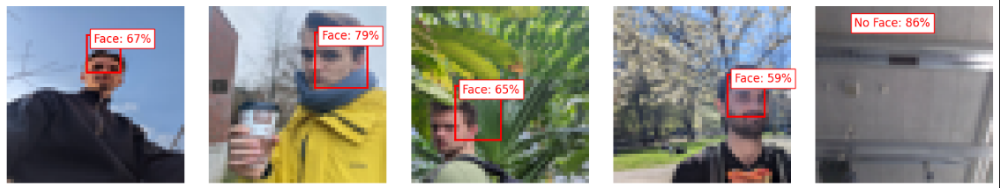

# Face Detection on the MAX78000 Microcontroller with the AI8X Framework

This project aims to demonstrate face detection using the AI8X training and synthesis framework on the MAX78000 microcontroller, specifically the MAXIM7800 FTHR_RevA development board. The project leverages the power of the hardware NN accelerator unit on the MAXIM78000. This requires a model that is tightly bound by the physical capabilities of the MCU. Moreover, an attempt is made to use the integrated camera on the development board to run real-time inferences.

## Repository structure

- `demo/`
    Contains demonstration scripts and configurations for ONET and RNET models.
    - `ONET_demo/`, `RNET_demo/`: Project files that can directly be flashed with the MSDK.
    - `live-inference-util.py`: Utility script for the live inference.

- `development/`
    Scripts for development and notebook for exploration.

- `docs/`
    Documentation and detailed results.

- `synthesis/`
    Contains files for model synthesis and deployment on hardware.
    - `custom_files/`: Files that have been modified after automatic code generation during synthesis.

- `training/`
    Files needed for the `ai8x-training`, including the dataloader, network, and MAX78000 hardware configuration YAML.

## Overview

The project consists of the following components:

1. Dataset: The project uses the WIDER Faces dataset, which contains images annotated with bounding boxes around faces.

2. Model Architecture: The face detection model is implemented using PyTorch and consists of convolutional layers, pooling layers, and fully connected layers. The architecture is designed to detect faces in input images and is based on the WIDER Faces dataset proposed network. 

3. Training: The model is trained using the AI8X framework. The training process involves optimizing the model parameters using the training dataset and a custom loss function specifically designed for face detection.

4. Inference: After training, the model is used to perform face detection on live images from the onboard camera of the MAXIM7800 FTHR_RevA development board. The detected faces are visualized in real-time using bounding boxes.

## Getting Started

To get started with this project, follow these steps:

1. Clone the repository:

   `git clone https://github.com/lionnus/maxim7800-face-detection.git`

2. Set up the ai8x-training and ai8x-synthesis environments and install the Maxim SDK.

3. Prepare the dataset:

   - Download the WIDER Faces dataset and place it in the appropriate directory. See Jupyter Notebook for changes made to the dataset structure.
   - Preprocess and transform the dataset using the provided scripts.

4. Train the model:
   - Copy the files from this repository to the `ai8x-training` folder with the provided script `copy_to_ai8x.sh`, adjust if necessary.

   - Run the training script to train the face detection model using the AI8X framework. Within the `ai8x-training` environment, run:

   `python train.py --lr 0.001 --optimizer adam --epochs 300 --batch-size 40 --deterministic --compress policies/schedule.yaml --qat-policy policies/qat_policy_widerfacenet.yaml --model widerfaceonet --dataset widerfaces  --param-hist --device MAX78000 "$@" --regression --enable-tensorboard`

4. Quantize, evaluate, and synthesize the model:
   - Go to `ai8x-training/logs` and pick your desired run. Pick the `qat_best.pth.tar` file and rename it to `widerfaceonetv2_trained.pth.tar`. Lastly, place it in the `ai8x-synthesis/trained` directory.

   - In the `ai8x-synthesis` environment quantize the model for the MAXIM7800 with the following command:

   `python quantize.py trained/widerfaceonetv5_trained.pth.tar trained/widerfaceonetv5_trained-q.pth.tar --device MAX78000 -v "$@"`

   - Evaluate the model in the `ai8x-training` environment:

   `python train.py --model widerfaceonet --dataset widerfaces --evaluate --exp-load-weights-from ../ai8x-synthesis/trained/widerfaceonetv5_trained-q.pth.tar --device MAX78000 "$@"` 
  
   **Note:** Removed --save_sample 10 since this gave the interesting error: "WARNING: Cannot save sample in training mode, ignoring --save-sample option. Use with --evaluate instead." The sample `sample_widerfaces.py` can be generated manually in the Jupyter Notebook.

   - Then, synthesize in the `ai8x-synthesize` environment with:

   `python ai8xize.py --test-dir synthed_net --prefix widerfaceonet --checkpoint-file trained/widerfaceonetv5_trained-q.pth.tar --config-file networks/widerfaceonet.yaml --device MAX78000 --compact-data  --mexpress --timer 0 --display-checkpoint --verbose "$@" --softmax --board-name FTHR_RevA --overwrite --no-unload --sample-input tests/sample_widerfaces_testpic2.npy` 

   **Note:** Generate sample_widerfaces.py manually in the Jupyter Notebook.

5. Deploy on MAX78000:

   - Use the Maxim SDK to flash the generated files onto the MAXIM78000. 
   - To enable extra features, e.g. input from camera stream, the generated files have to be changed. These custom files can be found in `synthesis/custom_files`

## Results
The project works with some accuracy. A few example outputs (retrieved from the generated `sampleoutput.h` file after synthesis), can be seen below for the RNet network. 

The demo can be flashed on a MAXIM7800 FTHR_RevA board with the files in the `demo/ONET_demo/` or `demo/RNET_demo/` folder. The `live-inference-utils.py` script can be used to communicate with the MAX78000 over UART and receive image and boundary box data every second.

## Contributing

Contributions to this project are welcome. If you have any ideas, suggestions, or improvements, feel free to open an issue or submit a pull request.

## License

This project is licensed under the [GPL GNU 3](LICENSE).

## Acknowledgments

This project is built upon the following technologies and resources:

- AI8X Training and Synthesis Framework
- Maxim SDK
- Pytorch
- Maxim7800 Microcontroller
- WIDER Faces Dataset

Special thanks to the contributors and maintainers of the above tools and resources.

## Contact

For any inquiries or questions, please contact me by email.
